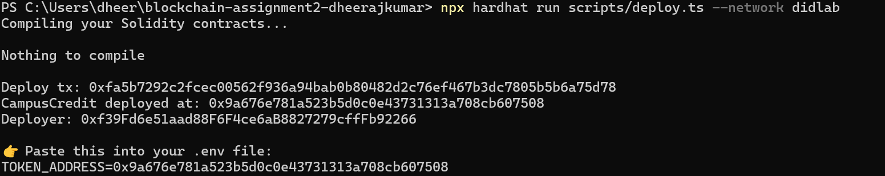
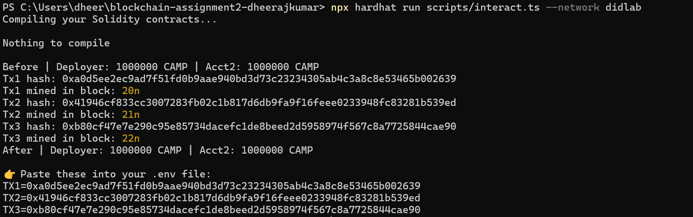
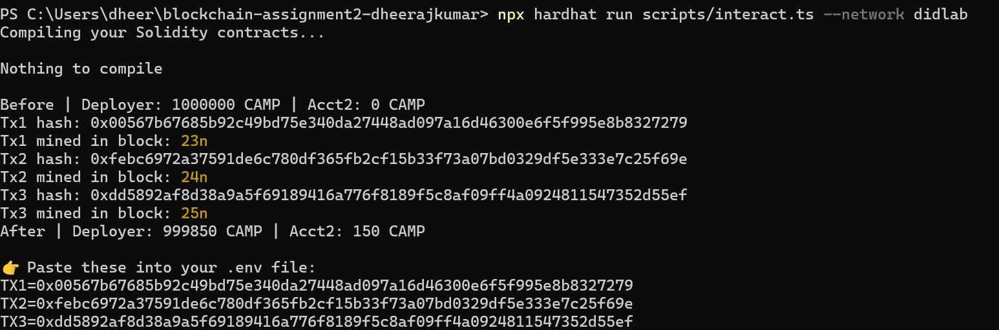
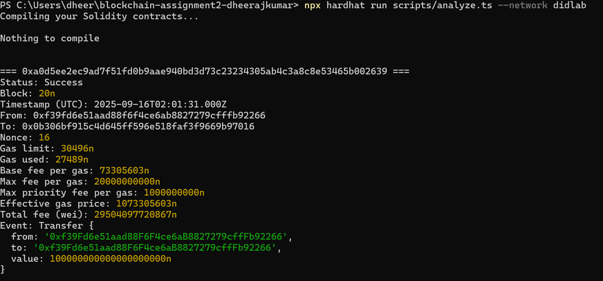
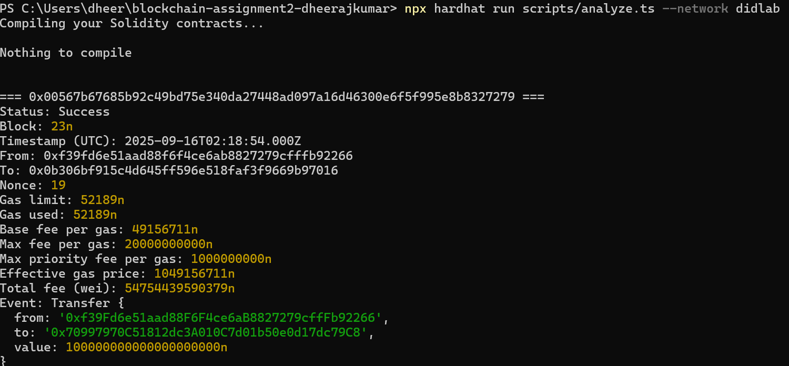
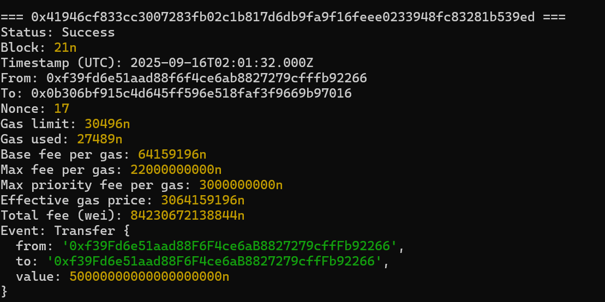
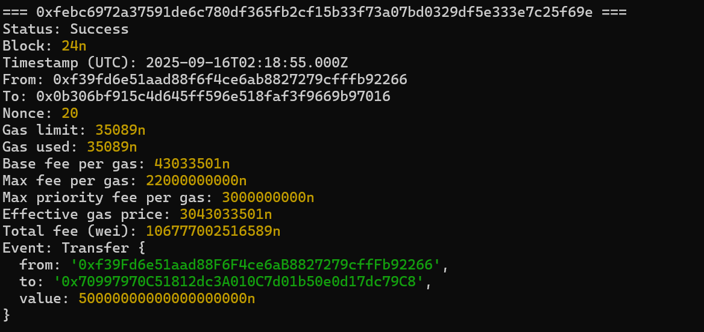
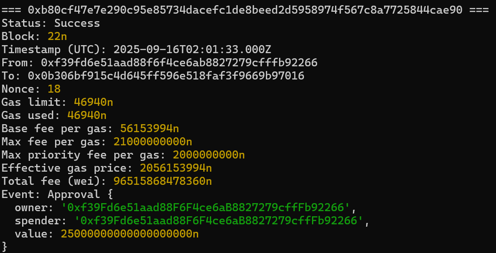
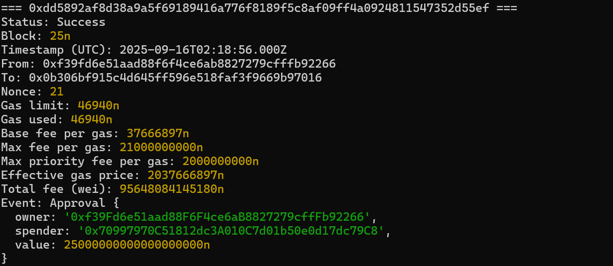
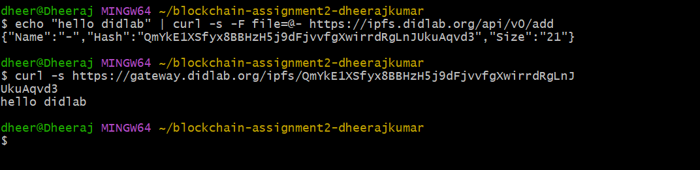

# Assignment 2 — Analyze Transactions with Hardhat

## Part A — Deployment
- **Contract Address**: 0x0b306bf915c4d645ff596e518faf3f9669b97016  
- **Symbol**: CAMP  
- **Decimals**: 18  
- **Initial Supply (human)**: 1,000,000 CAMP  
- **Initial Supply (raw)**: 1000000000000000000000000 (1e24)  

Compiler version: 0.8.24  
Scripts used: deploy.ts, interact.ts, analyze.ts  

## Code Files
- [CampusCredit.sol](contracts/CampusCredit.sol)
- [deploy.ts](scripts/deploy.ts)
- [interact.ts](scripts/interact.ts)
- [analyze.ts](scripts/analyze.ts)
- [hardhat.config.ts](hardhat.config.ts)

---

## Part B — Transaction Details

### Tx1 — Transfer 100 CAMP
- Status: Success  
- Block: 23  
- Timestamp (UTC): 2025-09-16T02:18:54Z  
- From: 0xf39f…92266 (EOA)  
- To: 0x0b30…7016 (Contract)  
- Nonce: 19  
- Gas Limit: 52189 | Gas Used: 52189  
- Base Fee: 49156711 wei  
- Max Fee: 20000000000 wei  
- Max Priority Fee: 1000000000 wei  
- Effective Gas Price: 1049156711 wei  
- Total Fee: 54754439590379 wei (~0.0000547 ETH)  
- Event: Transfer { raw: 100000000000000000000, human: 100 CAMP }  

### Tx2 — Transfer 50 CAMP
- Status: Success  
- Block: 24  
- Timestamp (UTC): 2025-09-16T02:18:55Z  
- From: 0xf39f…92266 (EOA)  
- To: 0x0b30…7016 (Contract)  
- Nonce: 20  
- Gas Limit: 35089 | Gas Used: 35089  
- Base Fee: 43033501 wei  
- Max Fee: 22000000000 wei  
- Max Priority Fee: 3000000000 wei  
- Effective Gas Price: 3043033501 wei  
- Total Fee: 106777002516589 wei (~0.0001067 ETH)  
- Event: Transfer { raw: 50000000000000000000, human: 50 CAMP }  

### Tx3 — Approve 25 CAMP
- Status: Success  
- Block: 25  
- Timestamp (UTC): 2025-09-16T02:18:56Z  
- From: 0xf39f…92266 (EOA)  
- To: 0x0b30…7016 (Contract)  
- Nonce: 21  
- Gas Limit: 46940 | Gas Used: 46940  
- Base Fee: 37666897 wei  
- Max Fee: 21000000000 wei  
- Max Priority Fee: 2000000000 wei  
- Effective Gas Price: 2037666897 wei  
- Total Fee: 95648084145180 wei (~0.0000956 ETH)  
- Event: Approval { raw: 25000000000000000000, human: 25 CAMP }  

📸 *Screenshot: Analyze output*

---

## Part C — Fee Comparison (Tx1 vs Tx2)
- Which landed first? Tx1 (Block 23).  
- Which had higher effective gas price? Tx2 (~3.04 gwei vs Tx1 ~1.04 gwei).  
- Which had higher tip? Tx2 (3 gwei vs Tx1 1 gwei).  

**EIP-1559**: Each block sets a base fee (burned). Users add `maxFeePerGas` and `maxPriorityFeePerGas` (tip). Effective gas = base fee + tip, capped by maxFee. Tx2 paid a bigger tip so it was prioritized.  

---

## Part D — Decimals & Conversion
ERC-20 tokens use 18 decimals.  

Example: Tx1 value = `100000000000000000000` (raw).  
Divide by 1e18 = `100 CAMP` (human).  

---

## Screenshots

### Deploy

### Interact

### Analyze
#### TX1

#### TX2

#### TX3

### IPFS (Optional)

---

## Repo Checklist
- contracts/CampusCredit.sol  
- scripts/deploy.ts  
- scripts/interact.ts  
- scripts/analyze.ts  
- hardhat.config.ts  
- .env (not committed)  
- .gitignore  
- report.md  
- screenshots/  
